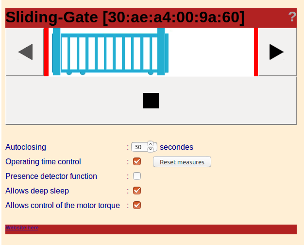

Sliding Gate
============

An ESP-WROOM-32 and arduino code to control a sliding gate with AC motor.

Software:
---------

A C++ code that controls the different elements of a sliding gate, namely:
- a 220v AC motor with oil bath,
- 24v photobeams,
- 2 magnetic limit sensors.
- 2 engine torque limiters,
- 1 presence detector input,
- 1 RF remote control input,
- automatic closing after a programmable delay,
- control of the opening and closing times,
- a web interface,
- OTA code update.
- integrable into home automation tools (domoticz, jeedom, ...) via http interfa
ces.

interface board: 

Screenshots:  

Hardware:
---------

The original microcontroller was an 18-pin PIC microcontroller (F745?) that froze from time to time ...

The remplacement part is an ESP-WROOM-32 :
- CPU: Xtensa dual-core 32-bit LX6 microprocessor, operating at 240 MHz and performing at up to 600 DMIPS
- 4MB SPI flash memory, support up to 16MB of flash memory,
- ultra low power (ULP) co-processor,
- Wi-Fi: 802.11 b/g/n (including WFA, WPA/WPA2 and WAPI),
- Bluetooth: v4.2 BR/EDR and BLE
- secure boot,
- Flash encryption,
- Cryptographic hardware acceleration: AES, SHA-2, RSA, elliptic curve cryptography (ECC), random number generator (RNG),
- multiple peripheral interfaces (see: https://en.wikipedia.org/wiki/ESP32)
- and a powerful power management, especially in embedded applications:
 - internal low-dropout regulator,
 - individual power domain for RTC,
 - 5uA deep sleep current,
 - wake up from GPIO interrupt, timer, ADC measurements, capacitive touch sensor interrupt

Problem: the PIC microcontroller support 5v on its I/O while the ESP only supports 3.3v. It will therefore be necessary to adapt the electrical levels: limit them on each input by a zener, upgrade outputs with transistor interfaces ...

TODO:
-----

- periodic wake up for the states recovery,
- use FreeRTOS multitasking...
- ...

DETAILS:
--------

Original part:

Replacement part:

Functional scheme:

Interface board:

Done:

